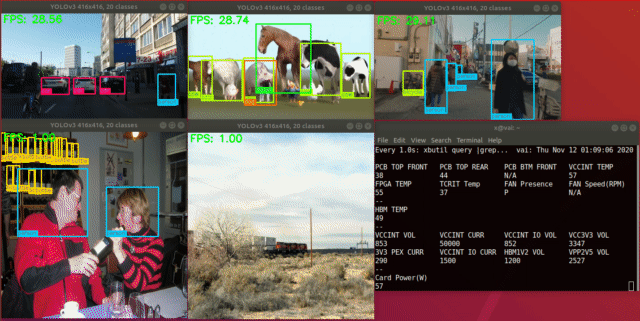

Overview
========

Vitis AI 1.2 YOLOv3 demo app.



ML server (C++)
===============

```bash
# Install required packages
sudo apt install automake cmake libtool

# Build server
./build_server.sh

# Start server
./bin/inf_server
```

YOLOv3 client (C++)
===================

```bash
# Install required packages
sudo apt install ffmpeg libopencv-dev libglew-dev libglfw3-dev libopenblas-dev libunwind-dev

# Build client
./build_client.sh

# Start video app
./yolov3_video.sh Pedestrians.mp4

# Start webcam app
./yolov3_webcam.sh 0
```
